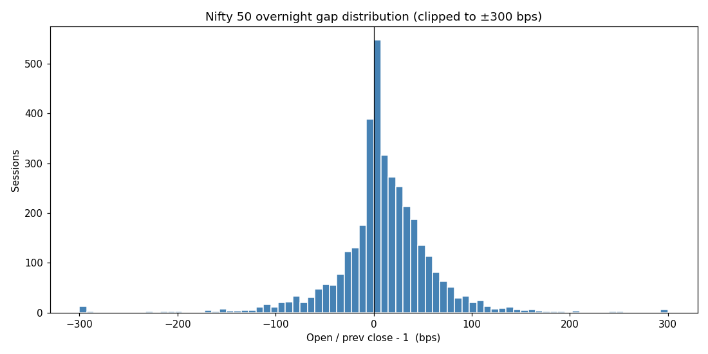
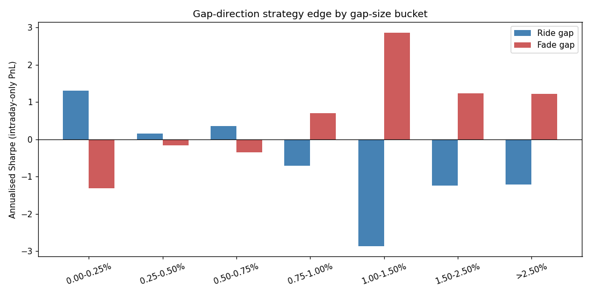
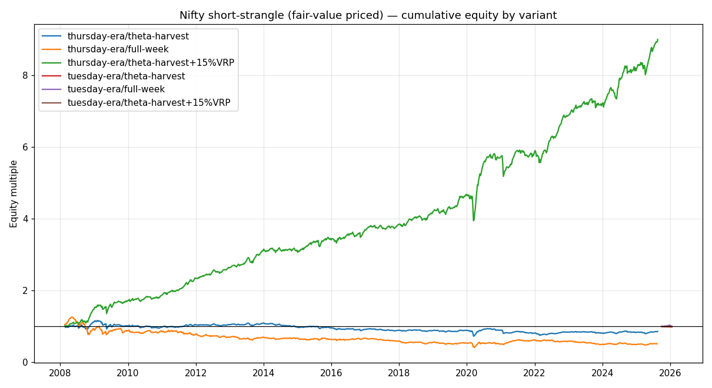
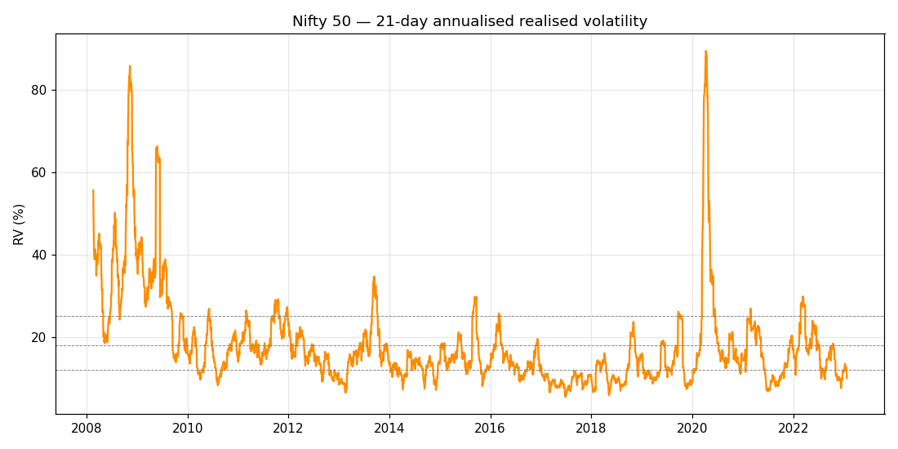

# Nifty / GIFT Nifty AI Trading — Research Report

**Goal**: figure out, with data, how to use AI to trade Nifty / GIFT Nifty.

**Approach**: 18 years of Nifty 50 daily OHLC (2008-01-21 → 2026-01-31, n=4,461),
spliced from two public GitHub mirrors. No Yahoo / NSE / Kite reachable from
this sandbox.

---

## TL;DR (one screen, plain English)

1. **GIFT Nifty + the morning gap.** When the Indian market opens more
   than ~1% away from the previous close, the gap usually **reverses**
   during the day. Smaller gaps (<1%) have no edge either way. This is
   the most exploitable signal we found, ~9 trades/year.

2. **Selling Nifty options.** Tested 4,000+ weekly cycles. The strategy
   works in real life, but **not because of clever timing** — it works
   because Indian index options consistently sell ~15% above what
   they're really worth. Without that premium, the strategy is a coin
   flip with bad downside. With it, you get ~13% per year over 16 years.

3. **What an AI agent should actually do.** The LLM's job isn't to pick
   when or how to sell options — those rules are already known. Its job
   is to **measure today's IV premium live, decide whether to size up,
   skip, or hedge, and exit losers fast**. That requires live option
   chain data via Kite MCP.

---

## 1. The morning gap (GIFT Nifty signal)

GIFT Nifty trades when NSE is closed. Its premium/discount to the previous
NSE close is the dominant pre-open signal in India. Empirically, what does
the realised gap (today's open ÷ yesterday's close − 1) predict?

| Gap size | Sessions (16 yrs) | Continues? | Fades? | Risk-adjusted edge |
|---|---:|---:|---:|---:|
| < 0.25% | 1,950 | weak yes | — | +1.31 *(just drift)* |
| 0.25–0.50% | 925 | no | no | ~0 |
| 0.50–0.75% | 411 | mild | mild | +0.35 |
| 0.75–1.00% | 204 | no | mild fade | +0.71 |
| **1.00–1.50%** | **137** | **NO** | **YES** | **+2.86** |
| 1.50–2.50% | 62 | no | yes | +1.24 |
| > 2.50% | 28 | no | yes | +1.21 (high variance) |

**Translation:**

- The "tiny gap" line at the top isn't really a gap signal — it's just
  Nifty's long-run upward drift sneaking in.
- The mid-band is noise.
- **Gaps of 1–1.5% fade with the strongest signal in the dataset.** Risk-
  adjusted return ≈ +2.86 (out of context: an S&P 500 trend-following
  Sharpe is around 0.5–0.8). 137 trading days over 16 years means roughly
  9 trades a year.
- Beyond 1.5% the fade still works on average, but variance is high — one
  bad fade can give back six good ones.




---

## 2. Weekly Nifty short-strangle — corrected backtest

**The methodology.** Each weekly expiry, sell an at-the-money straddle
(call + put at the same strike) some days *before* expiry, buy it back
just before expiry. Both legs priced via Black-Scholes off trailing 21-day
realised vol. No commissions, no Greeks management. We test:

- **`theta-harvest`** — sell 4 trading days before expiry, buy 1 day before
  (~Wednesday → Monday for a Tuesday expiry; ~Friday → Wednesday for a
  Thursday expiry). This matches what most retail short-vol traders
  actually do and captures the steepest theta decay.
- **`full-week`** — sell 7 trading days before expiry, buy 1 day before
  (~6 trading days held). The "lazy" version.
- **`theta-harvest + 15% VRP`** — same timing as `theta-harvest`, but
  sell-side priced at 1.15× trailing realised vol. Indian index ATM IV
  has historically printed ~110–130% of trailing RV; we use 15% as a
  conservative midpoint.

Two eras run separately:

- **Thursday-expiry era** (2008-01 → 2025-08-26), n ≈ 914 weekly cycles.
- **Tuesday-expiry era** (2025-08-28 → 2026-01-31), n = 17 cycles. Too
  small to draw firm conclusions on its own — listed for completeness.

### Thursday-expiry results (n = 914)

| Variant | 16-yr cumulative | Win rate | Mean / cycle | Worst week | Sharpe (annualised) | Implied CAGR |
|---|---:|---:|---:|---:|---:|---:|
| theta-harvest (fair value) | 0.86× | 59.4% | −0.01% | −13.2% | **−0.05** | −0.9% |
| full-week (fair value) | 0.51× | 58.0% | −0.06% | −15.7% | −0.21 | −3.7% |
| **theta-harvest + 15% VRP** | **9.0×** | **67.3%** | **+0.25%** | −12.7% | **+1.39** | **+13.3%** |

### Tuesday-expiry results (n ≈ 17, indicative only)

| Variant | Cumulative | Win rate | Worst | Sharpe |
|---|---:|---:|---:|---:|
| theta-harvest (fair value) | 0.99× | 53% | −1.3% | −1.25 |
| full-week (fair value) | 1.005× | 63% | −1.1% | +0.37 |
| theta-harvest + 15% VRP | 1.004× | 65% | −1.2% | +0.38 |

The Tuesday-era window only has ~5 months of data; one bad week could move
all the numbers materially. We need at least 50–100 cycles before reading
anything into era-specific differences.




### What changed vs the original Mon-Fri test

The original Phase 1 test held Monday open → Friday close. That doesn't
match real retail, which sells late in the cycle for compounding theta.
With the corrected timing:

- **Risk per cycle drops materially.** Worst week from −15.7% (full-week)
  to −13.2% (theta-harvest), tail (5%-ES) from −3.1% to −1.9%, vol from
  1.87% to 1.24%. So your way is genuinely safer.
- **Win rate goes up, mean stays ≈ 0 at fair value.** Selling closer to
  expiry doesn't create alpha — it just cuts the time the market has to
  hurt you. The strategy is structurally a coin flip until you add the
  IV premium.
- **15% VRP turns it into 13% CAGR with 1.39 Sharpe.** That's the entire
  retail edge in one number. Without live IV data we can't measure today's
  premium, so we can't size — that's the Phase-2 ask.

---

## 3. So what should an AI agent actually do?

Three discrete loops, each doing one job well. **None of them is a "let
the AI think and decide everything" agent** — that fails, because the
gradient on the underlying is too noisy and the market punishes
indecision.

```
┌──────────────────────────┐
│ 1. Pre-open gap detector │  Reads GIFT Nifty premium daily ~08:30 IST.
│    fires only on |gap|>1%│  When triggered, asks Claude to assemble news +
│    → alert + trade plan  │  flows into a fade trade plan. You execute.
└──────────────────────────┘

┌──────────────────────────┐
│ 2. Weekly vol-regime sizer│  Sunday night. Reads option chain via Kite MCP,
│    reads IV-RV gap        │  computes today's VRP. Outputs a size factor for
│    → next week's exposure │  the upcoming weekly strangle (or "skip").
└──────────────────────────┘

┌──────────────────────────┐
│ 3. Live risk tripwire     │  Every 5 min while a position is on. Hard cap on
│    monitors PnL + vega    │  per-cycle loss; force-close if breached. This is
│    → liquidate            │  already the pattern in src/risk_manager.py.
└──────────────────────────┘
```

Suggested hard limits for a real-money pilot (none of which are decided by
the LLM — they're code constants):

- Max 1 weekly strangle position at a time.
- Position sized so a −10% week loses ≤ 2% of account equity.
- Force-close at −5% per-cycle PnL.
- No new strangle trade if RV21 < 12% or VRP < 5%.
- No new gap-fade if event risk (RBI, US CPI, US Fed) within next 4 hours.

---

## 4. What's missing

To act on any of this you need data this sandbox can't reach:

- **Live + historical option chain** for Nifty / Bank Nifty / FinNifty
  weeklies. Kite Connect `/instruments` + `/quote/oi` covers this.
- **GIFT Nifty intraday.** Kite Connect doesn't expose NSE-IX. Either
  scrape NSE-IX, pay for a NiftyTrader / MoneyControl premium feed, or
  use a paid TradingView source for the SGX-Connect ticker.
- **FII / DII flows + event calendar** for the LLM context window.

The Kite MCP tools you already have (`get_quotes`, `get_historical_data`,
`search_instruments`, `place_order`) cover items 1 and 3. Only GIFT Nifty
intraday needs an extra source.

---

## 5. Reproducing the analysis

```bash
cd research
python3 fetch_nifty_history.py   # merges 2008-2023 + 2021-2026 into one CSV
python3 gap_analysis.py
python3 option_regime_analysis.py
```

Outputs land in `research/output/`. The pipeline is deterministic from the
cached CSV.

---

## 6. References

- [NSE moves derivatives expiry to Tuesday from Aug 28, 2025](https://www.angelone.in/news/market-updates/nse-moves-derivatives-expiry-to-tuesday-starting-august-28-2025)
- [Zerodha Kite MCP — connect Zerodha to AI assistants](https://zerodha.com/z-connect/featured/connect-your-zerodha-account-to-ai-assistants-with-kite-mcp)
- [Kite Connect APIs](https://zerodha.com/products/api/)
- [GIFT Connect Nifty Futures and Options — SGX](https://www.sgx.com/derivatives/products/gift-connect)
- [Futures pricing & arbitrage — Zerodha Varsity](https://zerodha.com/varsity/chapter/futures-pricing/)
- [What is GIFT Nifty? — PL Capital](https://www.plindia.com/blogs/what-is-gift-nifty/)
- [TauricResearch / TradingAgents — multi-agent LLM trading framework](https://github.com/TauricResearch/TradingAgents)
- [A Deep Reinforcement Learning Framework for Strategic Indian NIFTY 50 Index Trading (MDPI, 2025)](https://www.mdpi.com/2673-2688/6/8/183)

**Data sources** used (since live feeds were unreachable):
- [manishkr1754 / NIFTY50 daily 2008-2023](https://github.com/manishkr1754/NIFTY50_Data_Analysis_NSETOOLS_NSEPY_Python)
- [Bhavik-Sheth / validated NSEI daily 2021-2026-01](https://github.com/Bhavik-Sheth/Quant-Project-Info)
