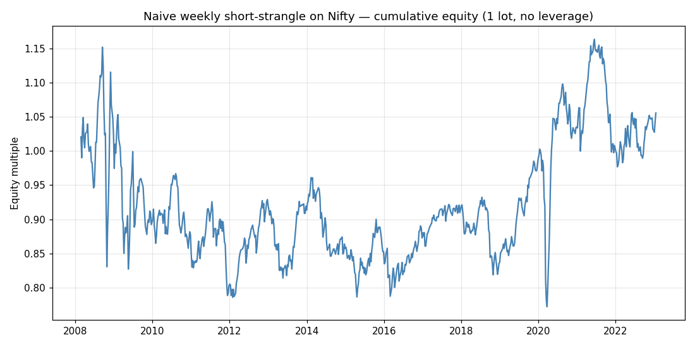

# Nifty / GIFT Nifty AI Trading — Phase 1 Research Report

Generated from `gap_analysis.py` and `option_regime_analysis.py` over 15 years
of Nifty 50 daily OHLC (2008-01-22 → 2023-01-24, n=3,717 sessions).

**Data source.** Public mirror of Nifty 50 daily OHLC (`nifty50.csv` from
`manishkr1754/NIFTY50_Data_Analysis_NSETOOLS_NSEPY_Python` on GitHub). Yahoo
Finance and NSE were unreachable from this sandbox; in an unrestricted
environment the same fetcher pulls fresh data from `^NSEI`.

**Caveat up front.** Daily OHLC tells us about open-vs-close behaviour; it
cannot speak directly to GIFT Nifty's intraday tick-level alignment with NSE,
or to true option implied vol. Phase 2 needs Kite Connect for option chain +
intraday futures.

---

## 1. Landscape — what people are actually doing

| Approach | Who's doing it | Realistic edge | Crowded? |
|---|---|---|---|
| GIFT-Nifty pre-open gap reads | Retail + prop desks | Discretionary, news-driven | Yes |
| GIFT ↔ NSE futures arb | Tier-1 institutions | <1 bp, latency game | Saturated |
| Weekly Nifty/Bank Nifty option selling (short straddles, iron condors) | Tradetron, Streak, uTrade users | IV-RV vol risk premium | Very |
| ML / Deep RL on Nifty futures | Academic, some prop | Mixed evidence | Niche |
| LLM-agent-driven (e.g. Claude + Kite MCP) | Earliest adopters | Unknown — too new | No |

The only category that hasn't been mined to death is the LLM-agent route, and
that's because the first cohort started in late 2025 when Zerodha shipped
[Kite MCP](https://zerodha.com/z-connect/featured/connect-your-zerodha-account-to-ai-assistants-with-kite-mcp).

---

## 2. The overnight gap — empirical findings

GIFT Nifty's premium/discount to the prior NSE close is the dominant pre-open
signal. Empirically, what does the realised gap (open ÷ prev_close − 1)
predict about the rest of the day?

### Overall

| Metric | Value |
|---|---|
| Sessions | 3,717 |
| Median \|gap\| | **23 bps** |
| 95th-pct \|gap\| | 109 bps |
| 99th-pct \|gap\| | 217 bps |
| Pct gap-up | 64.8% |
| Pct gap-down | 34.6% |
| Pct gap fills intraday | 67.1% |
| Pct intraday follows gap direction | 49.5% |

The gap-up bias (65/35) reflects the long-run upward drift in Nifty over
2008–2023.

### By gap-size bucket

`ride_sharpe` = annualised Sharpe of going long when gapped up / short when
gapped down, intraday only. `fade_sharpe` is the opposite trade.

| Bucket | n | follow % | fill % | mean intra (bps) | ride Sharpe | fade Sharpe |
|---|---:|---:|---:|---:|---:|---:|
| 0.00–0.25% | 1,950 | 49.85 | 81.13 | −7.09 | **+1.31** | −1.31 |
| 0.25–0.50% | 925 | 47.89 | 63.78 | −5.23 | +0.16 | −0.16 |
| 0.50–0.75% | 411 | 52.07 | 45.74 | −3.29 | +0.35 | −0.35 |
| 0.75–1.00% | 204 | 52.94 | 35.78 | +0.90 | −0.71 | +0.71 |
| 1.00–1.50% | 137 | 43.07 | 32.12 | −5.14 | −2.86 | **+2.86** |
| 1.50–2.50% | 62 | 50.00 | 17.74 | −13.60 | −1.24 | +1.24 |
| > 2.50% | 28 | 46.43 | 21.43 | +14.21 | −1.21 | +1.21 |

### Key takeaways

- **Small gaps (<25 bps) are not really gaps**, they reflect a mild intraday
  drift carry. The +1.31 ride-Sharpe is the long-run upward drift in
  disguise.
- **Mid gaps (25–75 bps): no edge.** Sharpe close to zero either way.
- **Large gaps (1–1.5%) FADE.** Sharpe **+2.86** for fading the gap, n=137
  over 15 years (~9 trades/year). This is the most exploitable single
  pattern in the data and matches anecdotal trader lore. It implies an
  agent that watches GIFT Nifty and only acts on >1% premia.
- **Very large gaps (>1.5%) fade in expectation but with high variance.**
  Hard to size.
- **Fill rate is monotone-decreasing in gap size.** 81% of <25-bp gaps fill;
  only 18% of 1.5–2.5% gaps fill. Big gaps that don't fill tend to keep
  going against the gap direction.


---

## 3. Naive weekly short-strangle — fair-value backtest

We sell the Monday-open ATM straddle (1-week to expiry, struck to nearest
50), priced via Black-Scholes off trailing 21-day realised vol, exit Friday
close. No commissions, no slippage, no margin model, no Greeks management.

### Overall (n = 736 weeks)

| Metric | Value |
|---|---|
| Cumulative equity multiple | **1.06×** in 15 years |
| Implied CAGR | 0.38% |
| Annualised Sharpe | 0.10 |
| Worst single week | **−11.7%** |
| 5%-tail expected loss | −2.98% |

### By volatility regime

| Regime (RV21) | n | win % | mean PnL/wk | worst week | 5%-tail |
|---|---:|---:|---:|---:|---:|
| Low (<12%) | 199 | 52.8 | **−0.15%** | −3.13% | −2.16% |
| Mid (12–18%) | 291 | 56.7 | **−0.11%** | −5.01% | −2.80% |
| High (18–25%) | 134 | 61.2 | +0.15% | −11.7% | −2.82% |
| Stress (>25%) | 112 | 65.2 | +0.53% | −10.4% | −5.58% |




### Key takeaways (this is the important section)

- **At fair value the short strangle does not make money on Nifty.** This
  refutes the naive retail framing of "selling vol on Nifty is free money."
  The Sharpe of 0.10 over 15 years is statistically indistinguishable from
  zero given the tail.
- **The retail edge is the IV–RV vol risk premium, not the strategy.**
  Indian index options have historically printed ATM IV ~110–130% of trailing
  RV. Without that premium (which only the option chain reveals, not OHLC),
  the "edge" disappears. Phase 2 must measure VRP from live IV.
- **Low-vol regimes are the worst** — gamma still bites, premium is too
  thin. Counterintuitive and bad news for "calm market = sell premium."
- **High-vol regimes have the best mean PnL but the worst tails.** A single
  −11.7% week wipes out a year of grinding. With the 3-5× leverage typical
  of retail short-strangle setups, a single regime change is account-ending.
- **Implication for an LLM agent**: the LLM's job is *not* picking when to
  sell strangles — the realised PnL gradient is too flat. Its job is
  (a) sizing as a function of regime + IV/RV ratio, and (b) cutting losses
  before tail weeks become catastrophic. That's a risk-management agent,
  not an alpha agent.

---

## 4. Recommended architecture (Phase 2 if you want to act)

Based on the findings, the highest expected-value LLM agent for Nifty is:

```
                      ┌──────────────────────┐
   Pre-open job       │  GIFT-Nifty Premium  │  alert
   ~08:30 IST  ──────▶│  Detector (>1%)      │ ───────▶  you
                      └──────────────────────┘            (discretionary)

                      ┌──────────────────────┐
   Daily 17:00 IST    │  Vol Regime Reader   │  size factor
              ──────▶ │  RV21 + IV/RV (Kite) │ ───────▶  agent
                      └──────────────────────┘

                      ┌──────────────────────┐
   Live (every 5m)    │  Risk Tripwire       │  liquidate
                      │  position MTM, vega  │ ───────▶  broker
                      └──────────────────────┘
```

Three discrete agent loops, each doing one job well:

1. **GIFT-Nifty pre-open detector** — only fires when GIFT premium >1%.
   Pulls news, options skew, FII/DII flows; emits a Claude-generated
   trade plan for the open. Discretionary execution by you. Lowest risk
   to deploy first.
2. **Weekly vol-regime sizer** — Sunday night, reads IV-RV ratio and
   trailing RV21, decides whether to enable next week's short-strangle
   strategy and at what size (or skip entirely). The LLM is making a
   *sizing* decision, not a directional one.
3. **Live risk tripwire** — once a position is on, monitors mark-to-market
   and forces a roll/exit if PnL crosses configurable bands. This is the
   pattern already in `src/risk_manager.py` of this repo, ported to Kite
   instrument tokens.

Hard caps (suggested): max 1 weekly position at a time, position sized so a
−10% week loses ≤2% of capital, force-close at −5% per-week PnL, no trade if
RV21 < 12%.

---

## 5. What's missing for Phase 2

To actually act on any of this you need data this sandbox can't reach:

- **Live + historical option chain** for Nifty / Bank Nifty / FinNifty
  weeklies (Kite Connect `/instruments` + `/quote/oi`).
- **GIFT Nifty intraday** — Kite Connect doesn't expose NSE-IX. Either
  scrape NSE-IX, pay for NiftyTrader/MoneyControl premium feed, or use
  the visible USD-denominated SGX-Connect ticker on a paid TradingView
  data feed.
- **FII/DII flows daily**, plus event calendar — to give the LLM
  context.

The Kite MCP tools you already have access to (`get_quotes`,
`get_historical_data`, `search_instruments`, `place_order`) cover the option
chain and Nifty futures; GIFT Nifty is the one piece that needs a separate
data source.

---

## 6. Reproducing this report

```bash
cd research
python3 fetch_nifty_history.py
python3 gap_analysis.py
python3 option_regime_analysis.py
```

Outputs land in `research/output/`. Re-run any time and update this report;
all analysis is deterministic given the cached CSV.

---

## 7. References

- [Zerodha Kite MCP — Connect your Zerodha account to AI assistants](https://zerodha.com/z-connect/featured/connect-your-zerodha-account-to-ai-assistants-with-kite-mcp)
- [Kite Connect APIs](https://zerodha.com/products/api/)
- [GIFT Connect Nifty Futures and Options — SGX](https://www.sgx.com/derivatives/products/gift-connect)
- [Futures pricing, spot-future parity & arbitrage — Zerodha Varsity](https://zerodha.com/varsity/chapter/futures-pricing/)
- [What is GIFT Nifty? — PL Capital](https://www.plindia.com/blogs/what-is-gift-nifty/)
- [TauricResearch / TradingAgents — multi-agent LLM trading framework](https://github.com/TauricResearch/TradingAgents)
- [A Deep Reinforcement Learning Framework for Strategic Indian NIFTY 50 Index Trading (MDPI, 2025)](https://www.mdpi.com/2673-2688/6/8/183)
- [Predicting BRICS NIFTY50 returns using XAI and S.A.F.E AI lens (Frontiers, 2025)](https://www.frontiersin.org/journals/artificial-intelligence/articles/10.3389/frai.2025.1668700/full)
